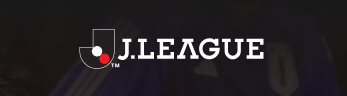

# Парсинг событий на сайте jleague.co

### 🖖 Проект по просьбе друга 😋

Парсинг игр в которых будет участвовать необходимый рефери :fire:

:yellow_circle: При нахождении нужного события отправляется сообщение в Telegram


## Как запустить проект:

### Клонировать репозиторий и перейти в него в командной строке:
```
git clone https://github.com/SlemCool/parse_site_jleague.git
```

```
cd parse_site_jleague
```

### Создать файл .env:

Вписать туда токен:

TELEGRAM_TOKEN = '<your telegram token>'


### Создать и активировать виртуальное окружение с помощью poetry:

```
poetry install
```

```
poetry shell
```


### Запустить проект:

```
python main.py
```